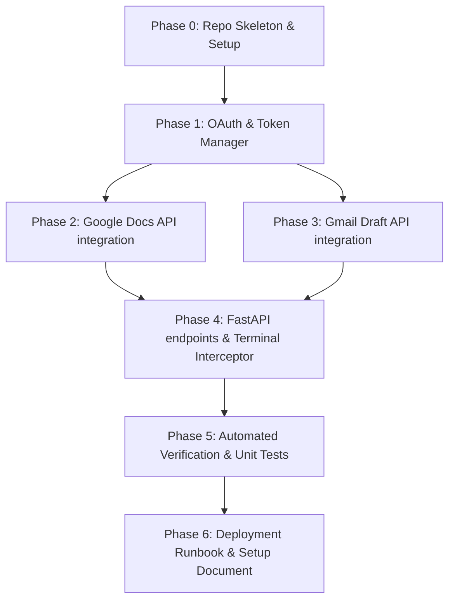

# Detailed Implementation Plan — Google Docs & Gmail MCP Server

This document outlines the detailed, phase-wise implementation plan for the Google Docs and Gmail MCP-style Python Server.

---

## 1. Requirements Traceability

The table below maps the functional and non-functional requirements to the specific implementation deliverables:

| Req ID | Requirement Description | Component / Phase | Verification Method |
|---|---|---|---|
| **REQ-01** | Create uvicorn-powered FastAPI server. | Phase 0 & Phase 4 (Server skeleton) | Server startup assertion tests |
| **REQ-02** | Implement `POST /append_to_doc` route accepting doc_id and content. | Phase 2 & Phase 4 (Docs tool / routes) | Endpoint route call unit assertions |
| **REQ-03** | Implement `POST /create_email_draft` route accepting recipient, subject, and body. | Phase 3 & Phase 4 (Gmail tool / routes) | Endpoint route call unit assertions |
| **REQ-04** | Block execution with a console prompt "Approve? (y/n)" on terminal stdin. | Phase 4 (Console Interceptor) | Intercept input test mocks |
| **REQ-05** | Standard Google OAuth2 flow using dynamic scopes for Docs and Gmail. | Phase 1 (OAuth Client) | OAuth authentication credentials instantiation |
| **REQ-06** | Read and store `token.json` locally; bypass browser login if token is fresh. | Phase 1 (Token Cache) | Local cache check verification |
| **REQ-07** | Use Google Docs API `endOfSegmentLocation` to append content to the end of the doc. | Phase 2 (Docs API) | Request structure verification |
| **REQ-08** | Encode email body to RFC 2822 base64 URL-safe string for Gmail draft creation. | Phase 3 (Gmail API) | Base64 decode output validation |

---

## 2. Environment Progression

```
[ Local Sandbox Mock ] ────> [ Staging OAuth Testing ] ────> [ Production Integration ]
  - Mock unittest assertions    - Real Browser OAuth flow     - Full MCP API bindings
  - No active credentials       - Dev credentials.json        - Configured client token
  - Mocked stdout/stdin inputs   - Terminal interactive inputs - Deployed Docker/FastAPI
```

* **Local Sandbox Mock**: Running tests using mock credentials and fake stdin inputs to verify API response handlers and Pydantic schemas.
* **Staging OAuth Testing**: Executing the server with real `credentials.json` client files to complete browser authorization and generate a valid `token.json`.
* **Production Integration**: Operating the server under a daemon process manager (e.g. Systemd) in an active agent shell to receive automated API calls.

---

## 3. Timeline & Parallelization

* **Total Indicative Duration**: 1–2 days.
* **MCP Efficiency Savings**: Separating Google API calls into standalone helper files (`docs_tool.py`, `gmail_tool.py`) allows parallel implementation and isolated module testing.

### Phase Dependency Diagram



---

## 4. Phase-Wise Implementation

### Phase 0: Repository Layout & Dependency Skeleton
* **Status**: `[x] COMPLETED`
* **Tasks**:
  - `[x]` Create the workspace directories.
  - `[x]` Write the package manifest dependencies in `requirements.txt`.
* **Deliverables**: Directory structure and `requirements.txt`.
* **Exit Criteria**: `uv pip install` installs all required libraries successfully.
* **Risks & Mitigation**: Package conflicts (e.g., mismatching Google Auth libraries). Mitigated by utilizing precise standard packages (`google-api-python-client`, `google-auth-httplib2`, `google-auth-oauthlib`).

---

### Phase 1: Authentication & Token Management
* **Status**: `[x] COMPLETED`
* **Tasks**:
  - `[x]` Define Docs and Gmail OAuth scopes.
  - `[x]` Set path configurations for `credentials.json` and `token.json` relative to script base folder.
  - `[x]` Implement `get_credentials()` inside `auth.py`.
* **Deliverables**: Google Auth module `auth.py`.
* **Exit Criteria**: Script successfully reads tokens or prompts for credentials file if missing.
* **Risks & Mitigation**: Path resolution issues if executed from different working directories. Mitigated by using absolute `__file__` directory joins.

---

### Phase 2: Google Docs API integration
* **Status**: `[x] COMPLETED`
* **Tasks**:
  - `[x]` Implement `append_to_doc()` function inside `docs_tool.py`.
  - `[x]` Configure payload structure to use `endOfSegmentLocation`.
* **Deliverables**: Google Docs API wrapper `docs_tool.py`.
* **Exit Criteria**: Invoking the function compiles a valid batchUpdate JSON request payload.
* **Risks & Mitigation**: Append index errors. Mitigated by setting an empty `segmentId` targeting the document body end.

---

### Phase 3: Gmail Draft API integration
* **Status**: `[x] COMPLETED`
* **Tasks**:
  - `[x]` Implement `create_email_draft()` function inside `gmail_tool.py`.
  - `[x]` Configure `EmailMessage` generation and URL-safe base64 encoding.
* **Deliverables**: Gmail API wrapper `gmail_tool.py`.
* **Exit Criteria**: Encoded email is wrapped in raw body payload structure.
* **Risks & Mitigation**: Encoding format failures. Mitigated by standardizing on `email.message.EmailMessage` bytes output.

---

### Phase 4: FastAPI Server & Terminal Interceptor
* **Status**: `[x] COMPLETED`
* **Tasks**:
  - `[x]` Initialize FastAPI application.
  - `[x]` Define Pydantic request models for both endpoints.
  - `[x]` Implement synchronous route handlers (`def` instead of `async def`) to block thread pool workers during CLI prompt execution.
  - `[x]` Implement console prompt loop checking for `y/n` inputs.
* **Deliverables**: Primary server file `server.py`.
* **Exit Criteria**: FastAPI server launches, registers endpoints, and asks for confirmation in CLI.
* **Risks & Mitigation**: Blocking the event loop. Mitigated by declaring synchronous endpoints that FastAPI automatically delegates to thread pools.

---

### Phase 5: Automated Verification & Unit Tests
* **Status**: `[x] COMPLETED`
* **Tasks**:
  - `[x]` Implement `test_server.py` containing endpoint route tests.
  - `[x]` Mock input, authorization, and client calls.
* **Deliverables**: Unit test module `test_server.py`.
* **Exit Criteria**: `uv run python -m unittest test_server.py` reports `OK`.
* **Risks & Mitigation**: Test runners stalling on blocking input prompts. Mitigated by completely mocking out standard terminal approvals.

---

### Phase 6: Runbook & Documentation
* **Status**: `[x] COMPLETED`
* **Tasks**:
  - `[x]` Document setting up Google Cloud API project and client credentials.
  - `[x]` Document endpoint formats and curl test cases.
* **Deliverables**: Usage guide `README.md`.
* **Exit Criteria**: Developer can configure credentials and run tests.
* **Risks & Mitigation**: Users attempting to run without OAuth setup. Mitigated by adding warning callouts in the document.
